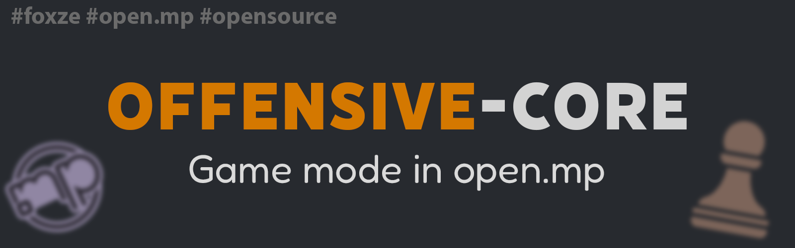

Offensive-Core - это большой проект сочетающий в себе многофункциональный игровой режим и сопутствующие 
к нему файлы написанные на языке Pawn для серверов open.mp.
На основе реализованных методов можно создавать абсолютно любимые режимы и подрежимы для них.
Код можно с лёгкостью модернизировать и расширять для своих нужд. В проекте представлены режимы: TDM, DM и Room.

Проект не является какой-либо модификацией других игровых режимов. 
Написан и продуман полностью с нуля.

## Основные системы
- Администрирование
- Транспорт
- Инвентарь
- Торговая площадка
- Дроп оружия и токенов
- Квесты
- Помощник Дина
- Режимы: TDM, DM, Room

# Логика работы всех режимов
Для начала нужно знать, что каждый режим находится в своей папке и имеет свои системы в файлах. 
В корневой папке каждого режима имеется папка "locations", в ней находится файл с различными системами для манипуляций 
с локациями и сами локации находятся в своих папках.

При запуске сервера происходит инициализация различных систем и создание/загрузка локаций для режимов (TDM, DM), 
когда происходит смена локации в режиме, то все созданнные компоненты (пикапы, объекты и т.д.) на локации удаляются 
и создаются новые для новой локации.

Такой метод создания и удаления локаций имеет много плюсов. 
Режимы можно делить на несколько сессий, поэтому нужно думать про лимиты SA-MP, 
а конкретнее про лимиты на создание Транспорта и GangZone, остальные компоненты 
по типу пикапов создаются динамическими.

Если обобщить, то каждый режим имеет свои папки и подпапки, 
также каждый режим можно делить на сессии, 
а локации в них создаются и удаляются.

Все режимы объединяет файл "system.pwn" в папке "game-modes". Это можно увидеть в самом коде.

# Архитектура
Архитектура проекта была сведена к максимальному упрощению и удобству в использовании. 
Как говорилось выше, каждый режим имеет свою папку, как и остальные системы. 
Самые базовые функции и системы находятся в файле "offensive-core.pwn". 
Остальные системы находятся в папке "sources". Некоторые системы находятся прямо в ней, это "vehicle", "admin" и т.д. 
Для игрока была отведена отдельная подпапка "player", для режимов "game-modes". 

Само распределение систем по файлам было логичным, т.к. хранить десятки тысяч строк кода в одном файле было уже 
довольно тяжело для редактирования чего-либо.

## Файлы
> header.inc - хранит информацию, которая в теории или уже на практике может использоваться в других системах (vars, define's, functions).

> system.pwn - это уже сами системы использующиеся в любых целях.

## Примечание
Изначально весь код был в одном файле и поэтому в коде можно встретить нелогичные моменты, но они ничуть не мешают работать.

# Мощный режим TDM
Изюминкой всего перечисленного является режим TDM. 
Для каждой локации в нём можно создавать различные индивидуальные моменты и ситуации, например, 
на локации "Пустыня" можно сбросить ядерную бомбу на противоположную команду. 

Чтобы это сделать, нужно захватить "Точку связи", дальше взорвать дверь, которая рядом и запустить спутник. 
Далее получить коды доступа командой /accode и попасть на подлодку и там уже запустить ядерную ракету, которая полетит на базу противника. 

При существующих системах конкретно для TDM режима, это уже легко реализуемо прямо в файле для локации "Пустыня". 
При этом всём, легко манипулировать различными компонентами через код, 
а созданные эти самые компоненты будут автоматически удалены при смене локации и снова возобновлены! 
Это работает в различных сессиях и они не связаны друг с другом.

# Разница между RU и RU-EN версией
Версия RU и RU-EN отличаются выбором языка на сервере и фундаментально в каких-то моментах. 
Сервер изначально делался под RU-EN версию, 
но вскоре это оказалось лишним и даже сильно мешающим.

Две версии работают, но рекомендуется выбрать RU версию, в ней изменена логика 
создания **CreatePlayer3DTextLabel** на диманическую **CreateDynamic3DTextLabel**.

В RU-EN версии для каждого игрока приходилось отдельно создавать 3DText функцией **CreatePlayer3DTextLabel** 
и это оказалось очень проблематично и неудобно.

# Wiki
Больше информации можно узнать в разделе [Wiki](https://github.com/NikitaFoxze/Offensive-Core/wiki)

# 🔧 Зависимости
Проект использует несколько популярных плагинов и файлов последних версий для улучшенной работы с кодом и их возможностями.

Плагины:
- [sscanf v2.13.8](https://github.com/Y-Less/sscanf)
- [streamer v2.9.6](https://github.com/samp-incognito/samp-streamer-plugin)
- [MySQL vR41-4](https://github.com/pBlueG/SA-MP-MySQL)
- [Pawn.CMD v3.4.0-omp](https://github.com/katursis/Pawn.CMD)
- [Pawn.RakNet v1.6.0-omp](https://github.com/katursis/Pawn.RakNet)
- [Pawn.Regex v1.2.3-omp](https://github.com/katursis/Pawn.Regex)
- [rustext v2.0.10](https://github.com/ziggi/rustext)
- [CrashDetect v4.22](https://github.com/Y-Less/samp-plugin-crashdetect)
- [Bcrypt v2.2.3](https://github.com/lassir/bcrypt-samp)

Файлы:
- [weapon-config](https://github.com/oscar-broman/samp-weapon-config)
- [nex-ac v1.9.66](https://github.com/NexiusTailer/Nex-AC)
- [foreach v2.2.7](https://github.com/Open-GTO/foreach)
- [mdialog v1.4.3](https://github.com/Open-GTO/mdialog)
- [cinterface v1.0.0](https://github.com/NikitaFoxze/cinterface)
- [StreamerFunctions](https://github.com/AbyssMorgan/SAMP/blob/main/Libs/StreamerFunction/StreamerFunction.inc)
- [progress2](https://github.com/Southclaws/progress2)

# Благодарности
- **NexiusTailer** - огромная помощь по различным темам
- **Neutralneu (Neuty)** - реализация системы для ботов
- **Roberto_Coluccio, Artem_Gorden, Danil_Marciface, VanilaSW, Dima_Rendi, Fix_Unvardo, Itsuki_Yorimoto, Flatt_Delx,
Fredorico_Viton, Demetrio_Santini, Maks_Anurov, Kocmoc, Vladislav_Barsov, Doni_Visage, DELIVER, Richi_Klay, Sebastian_Undeground** - помощь в тестировании
